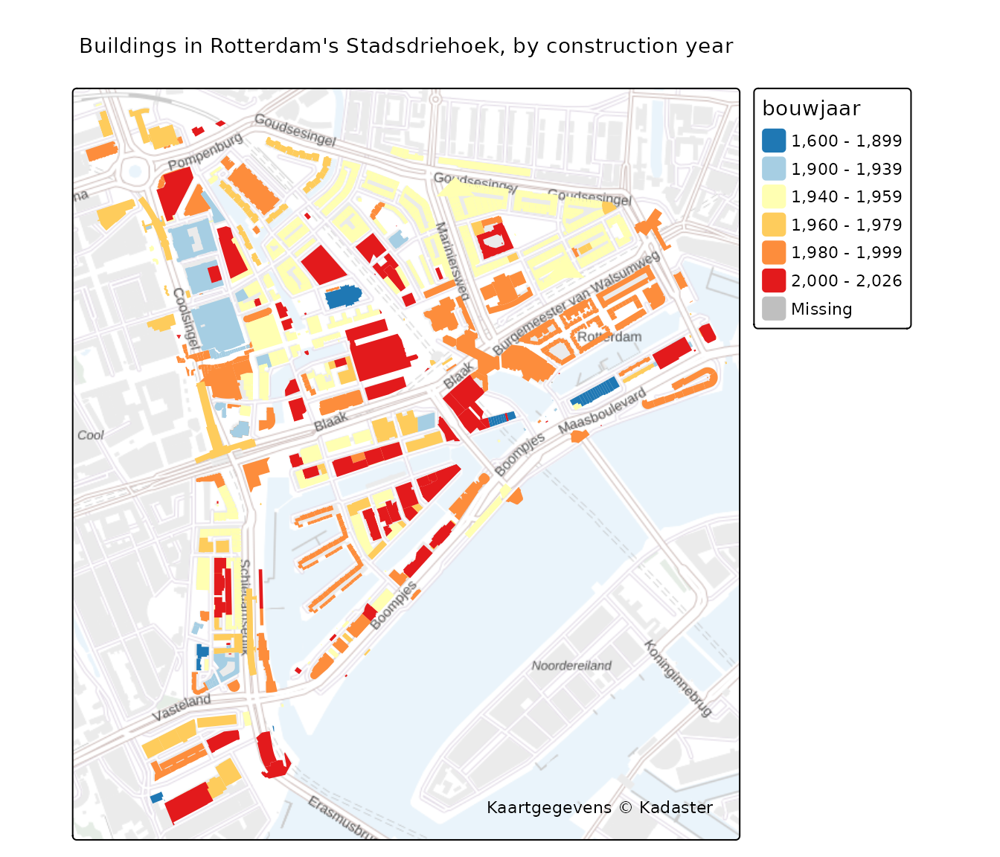

# Mapping buildings by construction year (BAG)

The [BAG](https://www.pdok.nl/) (Basisregistratie Adressen en Gebouwen)
holds every building in the Netherlands, with attributes such as the
year it was built. It is served over the OGC API Features service, so
[`pdok_read()`](https://coeneisma.github.io/pdokr/reference/pdok_read.md)
reads it like any other layer. This article maps the buildings of one
neighbourhood, coloured by construction year.

``` r

library(pdokr)
library(tmap)
library(dplyr)
#> 
#> Attaching package: 'dplyr'
#> The following objects are masked from 'package:stats':
#> 
#>     filter, lag
#> The following objects are masked from 'package:base':
#> 
#>     intersect, setdiff, setequal, union
```

## Choose an area

We use the administrative boundaries to select the `Stadsdriehoek`, the
historic centre of Rotterdam.

``` r

gemeenten <- pdok_read(
  "cbs/gebiedsindelingen", "gemeente_gegeneraliseerd", datetime = 2025
)
rotterdam <- filter(gemeenten, statnaam == "Rotterdam")

buurten <- pdok_read(
  "cbs/gebiedsindelingen", "buurt_gegeneraliseerd", datetime = 2025,
  filter_by = rotterdam, predicate = "within"
)
stadsdriehoek <- filter(buurten, statnaam == "Stadsdriehoek")
```

## Load every building in it

The `kadaster/bag` dataset has a `pand` (building) layer. We filter it
to the neighbourhood;
[`pdok_read()`](https://coeneisma.github.io/pdokr/reference/pdok_read.md)
pre-filters at the server and clips to the exact shape.

``` r

buildings <- pdok_read("kadaster/bag", "pand", filter_by = stadsdriehoek)
#> ⠙ Downloading PDOK features: 363 fetched
#> ⠹ Downloading PDOK features: 808 fetched
#> ⠹ Downloading PDOK features: 1022 fetched
nrow(buildings)
#> [1] 1022
```

BAG records an unknown construction year as `9999`; we set those to
`NA`.

``` r

buildings <- mutate(buildings, bouwjaar = na_if(bouwjaar, 9999))
range(buildings$bouwjaar, na.rm = TRUE)
#> [1] 1609 2026
```

## Map by construction year

Rotterdam’s historic centre was largely destroyed in the May 1940
bombing and rebuilt afterwards. To make that dividing line jump out, we
colour the buildings that pre-date the bombing (before 1940) in **cool
blues** and the post-war rebuild in **warm tones** — the surviving
pre-war buildings stand out against a sea of reconstruction.

``` r

tmap_mode("plot")
#> ℹ tmap modes "plot" - "view"
#> ℹ toggle with `tmap::ttm()`

era_scale <- tm_scale_intervals(
  breaks = c(1600, 1900, 1940, 1960, 1980, 2000, 2026),
  values = c("#1f78b4", "#a6cee3", "#ffffb2", "#fecc5c", "#fd8d3c", "#e31a1c")
)

tm_basemap(pdok_basemap("grijs")) +
  tm_shape(buildings) +
  tm_polygons(fill = "bouwjaar", fill.scale = era_scale, col = NULL) +
  tm_title("Buildings in Rotterdam's Stadsdriehoek, by construction year") +
  tm_credits("Kaartgegevens © Kadaster")
#> [plot mode] fit legend/component: Some legend items or map compoments do not
#> fit well, and are therefore rescaled.
#> ℹ Set the tmap option `component.autoscale = FALSE` to disable rescaling.
```



The same map interactively — zoom in and click a building:

``` r

tmap_mode("view")
#> ℹ tmap modes "plot" - "view"

tm_basemap(pdok_basemap("grijs")) +
  tm_shape(buildings) +
  tm_polygons(fill = "bouwjaar", fill.scale = era_scale, col = NULL,
              id = "identificatie", popup = tm_popup(vars = c("Built" = "bouwjaar"))) +
  tm_credits("Kaartgegevens © Kadaster")
```

## Where to next

- [Filtering data by
  area](https://coeneisma.github.io/pdokr/articles/filtering-by-area.md)
  — the load-then-filter workflow used here.
- [Combining with external
  data](https://coeneisma.github.io/pdokr/articles/duo-schools.md) —
  join `pdokr` with another open API.
- [PDOK
  basemaps](https://coeneisma.github.io/pdokr/articles/basemaps.md) —
  the grey background map used here, and the other styles.
