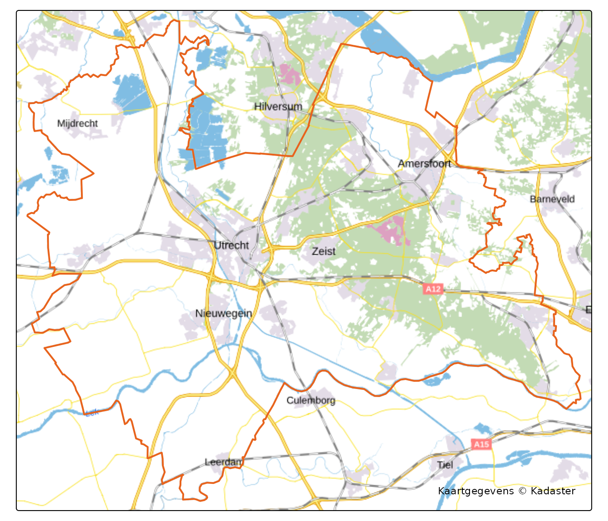

# PDOK basemaps

`pdokr` is for reading PDOK *data*. For the *background* of a map — the
reference topography under your own layers — PDOK publishes its official
basiskaart, and
[`pdok_basemap()`](https://coeneisma.github.io/pdokr/reference/pdok_basemap.md)
hands you the URL for it. Nothing is downloaded: you get a URL to pass
to your mapping package, so it is instant and works offline.

``` r

library(pdokr)
library(tmap)
library(sf)
#> Linking to GEOS 3.12.1, GDAL 3.8.4, PROJ 9.4.0; sf_use_s2() is TRUE
library(dplyr)
#> 
#> Attaching package: 'dplyr'
#> The following objects are masked from 'package:stats':
#> 
#>     filter, lag
#> The following objects are masked from 'package:base':
#> 
#>     intersect, setdiff, setequal, union
library(mapgl)
library(leaflet)
```

## Two kinds of basemap

[`pdok_basemap()`](https://coeneisma.github.io/pdokr/reference/pdok_basemap.md)
returns one of two things, set by `format`:

- **raster** (the default) — a classic tile URL (`{z}/{x}/{y}`,
  PNG/JPEG). Works with `tmap`, `leaflet` *and* `maplibre`/`mapgl`. The
  safe, universal choice.
- **vector** — a Mapbox-GL *style* URL. Works with `maplibre`/`mapgl`
  only, but stays razor-sharp at every zoom and can tilt into 3D.

``` r

pdok_basemap()                                # raster, default style
#> [1] "https://service.pdok.nl/brt/achtergrondkaart/wmts/v2_0/standaard/EPSG:3857/{z}/{x}/{y}.png"
pdok_basemap("grijs")                         # another raster style
#> [1] "https://service.pdok.nl/brt/achtergrondkaart/wmts/v2_0/grijs/EPSG:3857/{z}/{x}/{y}.png"
pdok_basemap("standaard", format = "vector")  # a vector style URL
#> [1] "https://api.pdok.nl/kadaster/brt-achtergrondkaart/ogc/v1/styles/standaard__webmercatorquad?f=mapbox"
```

The available styles differ per format:

| `format = "raster"` | `format = "vector"` |
|----|----|
| `standaard`, `grijs`, `pastel`, `water`, `luchtfoto` | `standaard`, `zonder_labels`, `luchtfoto`, `darkmode` |

(`luchtfoto` is aerial imagery.)

## Raster basemaps — tmap & leaflet

Hand the URL to
[`tm_basemap()`](https://r-tmap.github.io/tmap/reference/tm_basemap.html).
Here are the twelve province outlines on the standard PDOK basemap —
drawing only the borders keeps the basemap readable:

``` r

provinces <- pdok_read(
  "cbs/gebiedsindelingen", "provincie_gegeneraliseerd", datetime = 2025
)
```

``` r

tmap_mode("view")
#> ℹ tmap modes "plot" - "view"
#> ℹ toggle with `tmap::ttm()`

tm_basemap(pdok_basemap("standaard")) +
  tm_shape(provinces) +
  tm_borders(col = "#E8631C", lwd = 1.5) +
  tm_credits("Kaartgegevens © Kadaster")
```

In plain `leaflet` the same URL is the `urlTemplate`:

``` r

leaflet() |>
  addTiles(
    urlTemplate = pdok_basemap("standaard"),
    attribution = "Kaartgegevens &copy; Kadaster"
  ) |>
  addPolygons(data = st_transform(provinces, 4326))
```

A raster basemap is ordinary web tiles, so it also works in **static**
maps: switch to `tmap_mode("plot")` (or use `ggplot2` with
`maptiles`/`ggspatial`) and the tiles are downloaded and drawn into the
image. The vector style, by contrast, is rendered live in the browser,
so it is interactive-only.

``` r

tmap_mode("plot")
#> ℹ tmap modes "plot" - "view"

utrecht <- filter(provinces, statnaam == "Utrecht")

tm_basemap(pdok_basemap("standaard")) +
  tm_shape(utrecht) +
  tm_borders(col = "#E8631C", lwd = 2) +
  tm_credits("Kaartgegevens © Kadaster")
```



## The styles, side by side

The five raster styles over the same spot in Utrecht. Each tab is just
`leaflet() |> addTiles(pdok_basemap("<style>"))` — only the style name
changes.

- standaard
- grijs
- pastel
- water
- luchtfoto

## Vector basemaps — maplibre / mapgl

[`mapgl`](https://walker-data.com/mapgl/) brings the MapLibre and Mapbox
GL libraries to R: vector maps that stay sharp at any zoom and can tilt
into 3D. A GL map takes a *style* URL — exactly what
`pdok_basemap(format = "vector")` returns.

``` r

maplibre(style = pdok_basemap("standaard", format = "vector")) |>
  add_line_layer(
    id = "provinces", source = provinces,
    line_color = "#E8631C", line_width = 2
  ) |>
  fit_bounds(provinces, animate = FALSE)
```

## Which should I use?

|  | raster | vector |
|----|----|----|
| Works in | tmap, leaflet, mapgl | maplibre / mapgl |
| Extra package | none (you likely have tmap or leaflet) | `mapgl` |
| Look | fixed tiles, fine for most maps | razor-sharp, tiltable, 3D-capable |
| Best for | quick maps, the common case | polished, interactive, 3D |

When in doubt, use the **raster** default — it works everywhere.

## Attribution

The basemap data is © Kadaster / PDOK. Show this on any map that uses it
— via
[`tm_credits()`](https://r-tmap.github.io/tmap/reference/tm_credits.html)
in `tmap`, the `attribution =` argument in `leaflet`. The vector style
already carries its attribution, which `maplibre`/`mapgl` displays.

## Where to next

- [Getting
  started](https://coeneisma.github.io/pdokr/articles/getting-started.md)
  — reading and mapping PDOK data.
- [Filtering data by
  area](https://coeneisma.github.io/pdokr/articles/filtering-by-area.md)
  —
  [`pdok_filter_by()`](https://coeneisma.github.io/pdokr/reference/pdok_filter_by.md).
