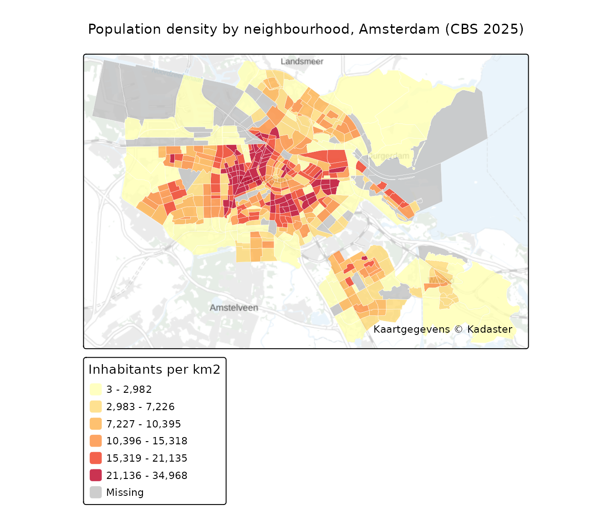

# Thematic maps from CBS statistics

Statistics Netherlands ([CBS](https://www.cbs.nl/)) publishes a yearly
dataset with hundreds of figures per neighbourhood — population, income,
housing, energy use, distance to amenities, and much more. Because PDOK
serves it with geometry, a single
[`pdok_read()`](https://coeneisma.github.io/pdokr/reference/pdok_read.md)
gives you everything you need for a choropleth. This article maps the
population density across the neighbourhoods of Amsterdam.

``` r

library(pdokr)
library(tmap)
library(dplyr)
#> 
#> Attaching package: 'dplyr'
#> The following objects are masked from 'package:stats':
#> 
#>     filter, lag
#> The following objects are masked from 'package:base':
#> 
#>     intersect, setdiff, setequal, union
```

## Read the neighbourhoods of one municipality

The `cbs/wijken-en-buurten-2025` dataset has `gemeenten`, `wijken` and
`buurten` layers. We take the boundary of Amsterdam from the `gemeenten`
layer, then read the `buurten` (neighbourhoods) inside it.

``` r

gemeenten <- pdok_read("cbs/wijken-en-buurten-2025", "gemeenten")
#> ⠙ Downloading PDOK features: 424 fetched
amsterdam <- filter(gemeenten, gemeentenaam == "Amsterdam")

buurten <- pdok_read(
  "cbs/wijken-en-buurten-2025", "buurten",
  filter_by = amsterdam, predicate = "within"
)
#> ⠙ Downloading PDOK features: 519 fetched
nrow(buurten)
#> [1] 519
```

## Handle the “no data” code

CBS marks a figure that is unknown or suppressed (too few cases, or a
non-residential area) with a large negative sentinel such as `-99997`.
We turn those into `NA` so they do not distort the map.

``` r

buurten <- buurten |>
  mutate(bevolkingsdichtheid_inwoners_per_km2 =
           if_else(bevolkingsdichtheid_inwoners_per_km2 < 0, NA_real_,
                   bevolkingsdichtheid_inwoners_per_km2))
summary(buurten$bevolkingsdichtheid_inwoners_per_km2)
#>    Min. 1st Qu.  Median    Mean 3rd Qu.    Max.     NAs 
#>       3    5689   10396   11815   17892   34968      44
```

The value is the number of inhabitants per square kilometre.

## Draw the choropleth

A quantile classification keeps each colour class roughly equal in size,
which works well for a skewed variable like density. Neighbourhoods
without a value (water, parks, industry) are drawn in grey.

``` r

tmap_mode("plot")
#> ℹ tmap modes "plot" - "view"
#> ℹ toggle with `tmap::ttm()`

tm_basemap(pdok_basemap("grijs")) +
  tm_shape(buurten) +
  tm_polygons(
    fill = "bevolkingsdichtheid_inwoners_per_km2",
    fill.scale = tm_scale_intervals(n = 6, style = "quantile",
                                    values = "brewer.yl_or_rd"),
    fill.legend = tm_legend("Inhabitants per km2"),
    col = "white", lwd = 0.2, fill_alpha = 0.8
  ) +
  tm_title("Population density by neighbourhood, Amsterdam (CBS 2025)") +
  tm_credits("Kaartgegevens © Kadaster")
#> [plot mode] fit legend/component: Some legend items or map compoments do not
#> fit well, and are therefore rescaled.
#> ℹ Set the tmap option `component.autoscale = FALSE` to disable rescaling.
```



The same map interactively — hover for the neighbourhood name and click
for the value. A little transparency lets the basemap show through, so
you keep your bearings:

``` r

tmap_mode("view")
#> ℹ tmap modes "plot" - "view"

tm_basemap(pdok_basemap("grijs")) +
  tm_shape(buurten) +
  tm_polygons(
    fill = "bevolkingsdichtheid_inwoners_per_km2",
    fill.scale = tm_scale_intervals(n = 6, style = "quantile",
                                    values = "brewer.yl_or_rd"),
    fill.legend = tm_legend("Inhabitants per km2"),
    col = "white", lwd = 0.2, fill_alpha = 0.6,
    id = "buurtnaam",
    popup = tm_popup(vars = c("Inhabitants per km2" = "bevolkingsdichtheid_inwoners_per_km2"))
  ) +
  tm_credits("Kaartgegevens © Kadaster")
```

To map a different figure, swap `bevolkingsdichtheid_inwoners_per_km2`
for another column — `aantal_inwoners`,
`stedelijkheid_adressen_per_km2`, or `gemiddelde_woningwaarde`, among
hundreds of others (some figures appear a year or two after the
boundaries).

## Where to next

- [Filtering data by
  area](https://coeneisma.github.io/pdokr/articles/filtering-by-area.md)
  — the load-then-filter workflow.
- [Coordinate reference
  systems](https://coeneisma.github.io/pdokr/articles/coordinate-reference-systems.md)
  — working in RD New (EPSG:28992), the Dutch national grid.
- [PDOK
  basemaps](https://coeneisma.github.io/pdokr/articles/basemaps.md) —
  the grey background map used here, and the other styles.
