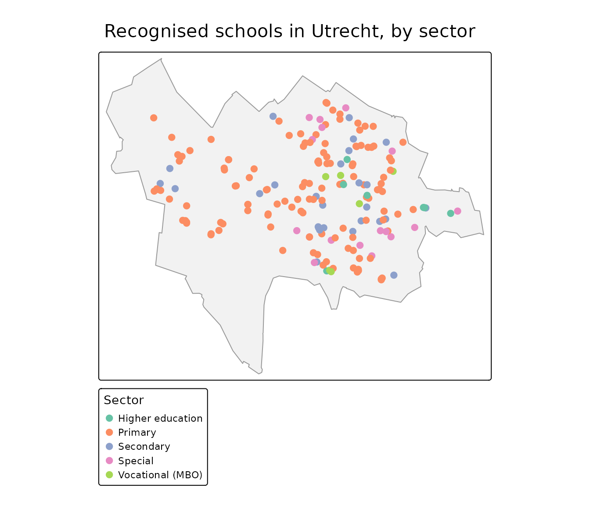

# Combining with external data: school locations (DUO)

PDOK is rarely the only source you need. A common pattern is to take a
table from another open API, turn it into spatial data, and combine it
with authoritative PDOK geometry. This article does that with
[DUO](https://duo.nl/)’s open data on schools — and shows that combining
sources often means a little data wrangling first.

``` r

library(pdokr)
library(tmap)
library(sf)
#> Linking to GEOS 3.12.1, GDAL 3.8.4, PROJ 9.4.0; sf_use_s2() is TRUE
library(dplyr)
#> 
#> Attaching package: 'dplyr'
#> The following objects are masked from 'package:stats':
#> 
#>     filter, lag
#> The following objects are masked from 'package:base':
#> 
#>     intersect, setdiff, setequal, union
library(httr2)
```

DUO publishes its data through a [CKAN open-data
API](https://onderwijsdata.duo.nl/). Every table is one resource. Some
are large, so this helper fetches one in pages, letting `httr2` retry
any request that drops.

``` r

read_duo <- function(resource_id, page_size = 5000) {
  pages <- list()
  offset <- 0
  repeat {
    resp <- request("https://onderwijsdata.duo.nl/api/3/action/datastore_search") |>
      req_url_query(resource_id = resource_id, limit = page_size, offset = offset) |>
      req_retry(max_tries = 4) |>
      req_perform() |>
      resp_body_json(simplifyVector = TRUE)
    page <- resp$result$records
    if (length(page) == 0) break
    pages[[length(pages) + 1]] <- page
    if (nrow(page) < page_size) break
    offset <- offset + page_size
  }
  do.call(rbind, pages)
}
```

## Fetch the education locations

The `onderwijslocaties` resource lists every location where education
*may* take place, each with coordinates and a `BAG_ID`.

``` r

locations <- read_duo("a7e3f323-6e46-4dca-a834-369d9d520aa8")
nrow(locations)
#> [1] 13610
```

There is a catch: these are *possible* education locations, not
recognized schools. A conference center that hosts the odd exam, or a
commercial training firm, is in here too. Mapping them straight away
would put dots where no school exists.

## Keep only the recognized schools

To find the schools recognized in law we combine two more DUO tables.
The `relaties...` resource links a location (`ONDERWIJSLOCATIECODE`) to
a recognized institution (`VESTIGINGSCODE`); the `vestigingserkenningen`
resource describes that institution — its name and the education law it
falls under (`WET`). Both tables are historical, so a row counts only
when it has no `EINDDATUM`.

``` r

relations    <- read_duo("c18ec7dd-aa4e-4b51-997c-782955f1aa38")
institutions <- read_duo("01fd2a5f-40af-456f-864d-13265a51e5e2")

# translate the education-law code into a readable sector
sectors <- c(WPO = "Primary", WVO = "Secondary", WEC = "Special",
             WEB = "Vocational (MBO)", WHW = "Higher education")

# current institutions (no end date), one row each, with a readable sector
institutions <- institutions |>
  filter(is.na(EINDDATUM)) |>
  distinct(VESTIGINGSCODE, .keep_all = TRUE) |>
  mutate(sector = unname(sectors[WET])) |>
  select(VESTIGINGSCODE, sector, school = VOLLEDIGE_NAAM)

# current location -> recognized institution, one institution per location
link <- relations |>
  filter(is.na(EINDDATUM)) |>
  select(ONDERWIJSLOCATIECODE, VESTIGINGSCODE) |>
  inner_join(institutions, by = "VESTIGINGSCODE") |>
  distinct(ONDERWIJSLOCATIECODE, .keep_all = TRUE)

# inner join drops every location without a recognized institution
schools <- inner_join(locations, link, by = "ONDERWIJSLOCATIECODE")
nrow(schools)
#> [1] 9679
count(schools, sector)
#>             sector    n
#> 1 Higher education   62
#> 2          Primary 7230
#> 3        Secondary 1476
#> 4          Special  708
#> 5 Vocational (MBO)  203
```

Only the locations backed by a recognized institution remain — no
training venues, no exam halls — and each carries its school name and
education sector.

One quirk worth knowing: a university or college is registered as a
*single* recognized institution, so only its official location appears
here, not its every building. The map below is therefore dominated by
primary and secondary schools, which register each site.

## Make it spatial and combine with PDOK

The coordinates are WGS84 longitude/latitude, so we build an `sf` object
and use
[`pdok_filter_by()`](https://coeneisma.github.io/pdokr/reference/pdok_filter_by.md)
with a municipal boundary to zoom in on Utrecht.

``` r

schools <- schools |>
  filter(!is.na(GPS_LONGITUDE), !is.na(GPS_LATITUDE)) |>
  st_as_sf(coords = c("GPS_LONGITUDE", "GPS_LATITUDE"), crs = 4326)

gemeenten <- pdok_read(
  "cbs/gebiedsindelingen", "gemeente_gegeneraliseerd", datetime = 2025
)
utrecht <- filter(gemeenten, statnaam == "Utrecht")

utrecht_schools <- pdok_filter_by(schools, utrecht, predicate = "within")
nrow(utrecht_schools)
#> [1] 186
```

``` r

tmap_mode("plot")
#> ℹ tmap modes "plot" - "view"
#> ℹ toggle with `tmap::ttm()`

tm_shape(utrecht) +
  tm_polygons(fill = "grey95", col = "grey60") +
  tm_shape(utrecht_schools) +
  tm_dots(
    fill = "sector", size = 0.5,
    fill.scale = tm_scale_categorical(values = "brewer.set2"),
    fill.legend = tm_legend("Sector")
  ) +
  tm_title("Recognized schools in Utrecht, by sector")
```



## Map the school buildings

Each school sits in a building from the BAG. We read the `pand`
(building) layer for the historic center, keep the footprints that
contain a school, and carry the school name and sector across with a
spatial join.

``` r

wijken <- pdok_read(
  "cbs/gebiedsindelingen", "wijk_gegeneraliseerd", datetime = 2025,
  filter_by = utrecht, predicate = "within"
)
binnenstad <- filter(wijken, grepl("Binnenstad", statnaam))
centre_schools <- pdok_filter_by(utrecht_schools, binnenstad, predicate = "within")

panden <- pdok_read("kadaster/bag", "pand", filter_by = binnenstad)
#> ⠙ Downloading PDOK features: 1058 fetched
#> ⠹ Downloading PDOK features: 1558 fetched
#> ⠸ Downloading PDOK features: 2555 fetched
#> ⠼ Downloading PDOK features: 4013 fetched
#> ⠴ Downloading PDOK features: 5569 fetched
#> ⠦ Downloading PDOK features: 6026 fetched
school_buildings <- panden |>
  st_filter(centre_schools) |>
  st_join(select(centre_schools, school, sector, STRAATNAAM))
nrow(school_buildings)
#> [1] 11
```

The result is real school buildings, colored by sector. Click one for
the school that uses it.

``` r

tmap_mode("view")
#> ℹ tmap modes "plot" - "view"

tm_basemap(pdok_basemap("grijs")) +
  tm_shape(school_buildings) +
  tm_polygons(
    fill = "sector",
    fill.scale = tm_scale_categorical(values = "brewer.set2"),
    fill.legend = tm_legend("Sector"),
    col = "grey30", lwd = 0.5, id = "school",
    popup = tm_popup(vars = c("School" = "school", "Sector" = "sector",
                              "Street" = "STRAATNAAM"))
  ) +
  tm_credits("Kaartgegevens © Kadaster")
```

## Where to next

- [Filtering data by
  area](https://coeneisma.github.io/pdokr/articles/filtering-by-area.md)
  — more on
  [`pdok_filter_by()`](https://coeneisma.github.io/pdokr/reference/pdok_filter_by.md).
- [Mapping buildings by construction
  year](https://coeneisma.github.io/pdokr/articles/bag-buildings.md) —
  another BAG example, using the `pand` (building) layer.
- [PDOK
  basemaps](https://coeneisma.github.io/pdokr/articles/basemaps.md) —
  the gray background map used here, and the other styles.
