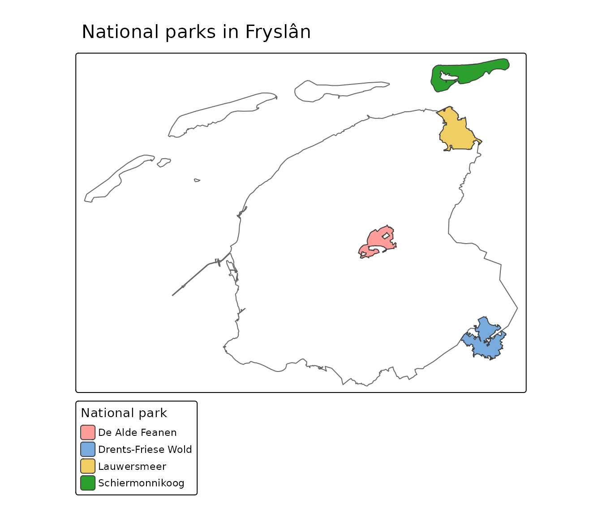

# Filtering data by area

A very common task is *“give me this layer, but only within that area”*
— all national parks in a province, all wells in a water-authority
district, every building in a municipality. PDOK cannot do this
directly: its services can pre-filter by a rectangle (a bounding box),
but not by an arbitrary polygon. `pdokr` bridges that gap, and
[`pdok_read()`](https://coeneisma.github.io/pdokr/reference/pdok_read.md)
makes it a one-liner.

``` r

library(pdokr)
library(tmap)
```

## 1. Get a filter geometry

The area you filter by is just an `sf` polygon. The most common source
is the CBS administrative boundaries (`"cbs/gebiedsindelingen"`). Here
we take the province of Fryslân.

``` r

provinces <- pdok_read(
  "cbs/gebiedsindelingen", "provincie_gegeneraliseerd",
  datetime = 2025
)
fryslan <- provinces[provinces$statnaam == "Fryslân", ]
```

Any polygon works, though: a nature reserve, a water-authority area, a
polygon you drew yourself, or a result from
[`pdok_geocode()`](https://coeneisma.github.io/pdokr/reference/pdok_geocode.md)
(see the last section).

## 2. Filter another layer to that area

Pass the filter geometry to
[`pdok_read()`](https://coeneisma.github.io/pdokr/reference/pdok_read.md)
as `filter_by`. It uses the polygon’s bounding box as a cheap
server-side pre-filter, then clips the result to the exact shape. Here
we keep only the national parks that lie within Fryslân.

``` r

parks <- pdok_read(
  "rvo/nationale-parken-geharmoniseerd", "protectedsite",
  filter_by = fryslan
)
parks$text
#> [1] "De Alde Feanen"     "Drents-Friese Wold" "Lauwersmeer"       
#> [4] "Schiermonnikoog"
```

A static map of the province with its national parks:

``` r

tmap_mode("plot")
#> ℹ tmap modes "plot" - "view"
#> ℹ toggle with `tmap::ttm()`

tm_shape(fryslan) +
  tm_borders(col = "grey40") +
  tm_shape(parks) +
  tm_polygons(fill = "text", fill.legend = tm_legend("National park")) +
  tm_title("National parks in Fryslân")
```



The same in interactive mode — zoom in and click a park:

``` r

tmap_mode("view")
#> ℹ tmap modes "plot" - "view"

tm_basemap("CartoDB.Positron") +
  tm_shape(parks) +
  tm_polygons(fill = "text", fill_alpha = 0.6, id = "text",
              fill.legend = tm_legend("National park"))
```

## 3. What happens under the hood

`filter_by` folds a two-stage workflow into one call. You can also run
the two stages yourself, which is useful when you want to reuse the
pre-filtered data or apply a different spatial predicate.

``` r

# Stage 1: cheap server-side pre-filter by the bounding box of Fryslân
parks_in_bbox <- pdok_read(
  "rvo/nationale-parken-geharmoniseerd", "protectedsite",
  bbox = fryslan
)

# Stage 2: exact client-side clip to the polygon
pdok_filter_by(parks_in_bbox, fryslan)$text
#> [1] "De Alde Feanen"     "Drents-Friese Wold" "Lauwersmeer"       
#> [4] "Schiermonnikoog"
```

[`pdok_filter_by()`](https://coeneisma.github.io/pdokr/reference/pdok_filter_by.md)
reconciles coordinate reference systems for you and accepts a
`predicate` (`"intersects"` by default, but also `"within"`,
`"contains"`, and more). The plain-`sf` equivalent, once both objects
share a CRS, is:

``` r

fryslan_ll <- sf::st_transform(fryslan, sf::st_crs(parks_in_bbox))
parks_in_bbox[fryslan_ll, , op = sf::st_intersects]$text
#> [1] "De Alde Feanen"     "Drents-Friese Wold" "Lauwersmeer"       
#> [4] "Schiermonnikoog"
```

## 4. From an address to its area

Because `filter_by` also accepts a point, you can answer *“which
municipality is this address in?”* Geocode the address with
[`pdok_geocode()`](https://coeneisma.github.io/pdokr/reference/pdok_geocode.md),
then filter the municipalities by that point.

``` r

address <- pdok_geocode("Tweebaksmarkt 52, Leeuwarden")

pdok_read(
  "cbs/gebiedsindelingen", "gemeente_gegeneraliseerd",
  datetime = 2025, filter_by = address
)$statnaam
#> [1] "Leeuwarden"
```

The same idea scales up: geocode a place as a polygon (for example
`pdok_geocode("Fryslân", type = "provincie")`) and use it directly as
`filter_by`.

## Where to next

- [Geocoding](https://coeneisma.github.io/pdokr/articles/geocoding.md) —
  turn a place name into the boundary you filter by.
- [Mapping buildings by construction
  year](https://coeneisma.github.io/pdokr/articles/bag-buildings.md) —
  read a BAG layer inside an area.
- [Thematic maps from CBS
  statistics](https://coeneisma.github.io/pdokr/articles/cbs-statistics.md)
  — a choropleth for one municipality’s neighbourhoods.
