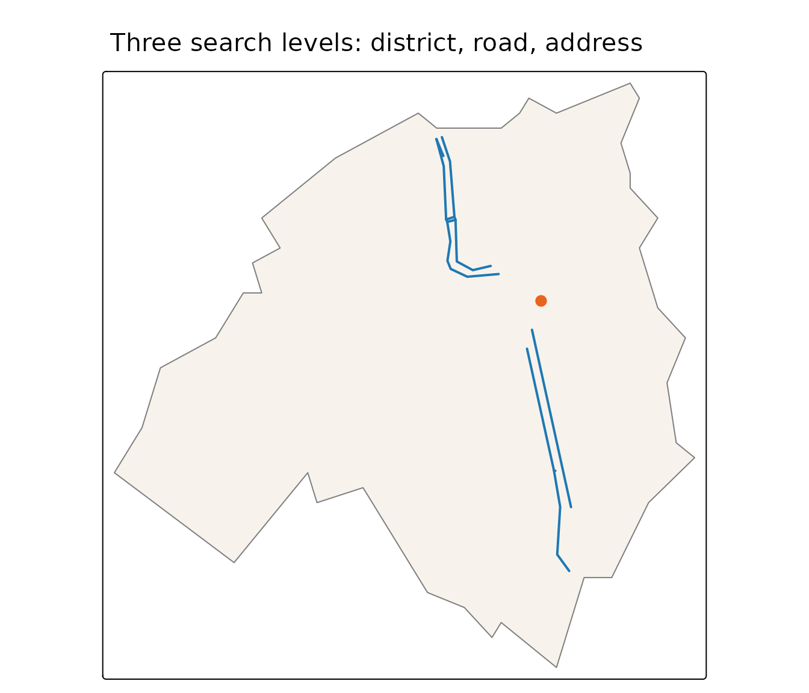

# Geocoding: from names to locations

[`pdok_geocode()`](https://coeneisma.github.io/pdokr/reference/pdok_geocode.md)
turns a name — an address, a postcode, a street, a town, a municipality,
a province — into spatial data, using the PDOK
[Locatieserver](https://www.pdok.nl/). The result is an `sf` object, so
it plugs straight into the rest of `pdokr`: most usefully, a geocoded
boundary can be handed to the `filter_by` argument of
[`pdok_read()`](https://coeneisma.github.io/pdokr/reference/pdok_read.md).

``` r

library(pdokr)
library(tmap)
library(dplyr)
#> 
#> Attaching package: 'dplyr'
#> The following objects are masked from 'package:stats':
#> 
#>     filter, lag
#> The following objects are masked from 'package:base':
#> 
#>     intersect, setdiff, setequal, union
```

## A name to a point

In its simplest form you pass a query and get back the single best
match.

``` r

home <- pdok_geocode("Domplein 1, Utrecht")
home |> select(weergavenaam, type, score)
#> Simple feature collection with 1 feature and 3 fields
#> Geometry type: MULTILINESTRING
#> Dimension:     XY
#> Bounding box:  xmin: 5.12111 ymin: 52.09004 xmax: 5.1224 ymax: 52.09118
#> Geodetic CRS:  WGS 84
#> # A tibble: 1 × 4
#>   weergavenaam      type  score                                         geometry
#>   <chr>             <chr> <dbl>                            <MULTILINESTRING [°]>
#> 1 Domplein, Utrecht weg    15.4 ((5.12193 52.09004, 5.12149 52.09093), (5.12149…
```

It is an ordinary `sf` object with a point geometry, ready to map.

``` r

tmap_mode("view")
#> ℹ tmap modes "plot" - "view"
#> ℹ toggle with `tmap::ttm()`

tm_basemap(pdok_basemap("grijs")) +
  tm_shape(home) +
  tm_dots(fill = "#E8631C", size = 1) +
  tm_credits("Kaartgegevens © Kadaster")
```

## Search levels: the `type` argument

The Locatieserver does not only know addresses. Every result has a
`type`, and the geometry you get back depends on it — a point for
pinpoint locations, a line for a road, a polygon for an area.

| `type`              | Geometry | What it is                  |
|---------------------|----------|-----------------------------|
| `adres`             | point    | a specific address          |
| `postcode`          | point    | the centre of a postcode    |
| `hectometerpaal`    | point    | a motorway distance marker  |
| `appartementsrecht` | point    | an apartment right          |
| `weg`               | line     | a (named) road              |
| `buurt`, `wijk`     | polygon  | a neighbourhood or district |
| `woonplaats`        | polygon  | a town or city              |
| `gemeente`          | polygon  | a municipality              |
| `provincie`         | polygon  | a province                  |
| `perceel`           | polygon  | a cadastral parcel          |

By default
[`pdok_geocode()`](https://coeneisma.github.io/pdokr/reference/pdok_geocode.md)
returns the best match of *any* type, ranked by the service’s relevance
`score`. That is convenient, but a single name often exists at several
levels — “Utrecht” is a municipality, a province, *and* a town:

``` r

pdok_geocode("Utrecht", limit = 5) |>
  select(weergavenaam, type, score)
#> Simple feature collection with 5 features and 3 fields
#> Geometry type: MULTIPOLYGON
#> Dimension:     XY
#> Bounding box:  xmin: 4.9701 ymin: 52.02628 xmax: 5.19515 ymax: 52.14205
#> Geodetic CRS:  WGS 84
#> # A tibble: 5 × 4
#>   weergavenaam                  type       score                        geometry
#>   <chr>                         <chr>      <dbl>              <MULTIPOLYGON [°]>
#> 1 Gemeente Utrecht              gemeente    9.78 (((5.01801 52.06222, 5.01707 5…
#> 2 Utrecht, Utrecht, Utrecht     woonplaats  8.82 (((5.01514 52.11395, 5.01553 5…
#> 3 Haarzuilens, Utrecht, Utrecht woonplaats  8.59 (((4.97775 52.13057, 4.97394 5…
#> 4 Vleuten, Utrecht, Utrecht     woonplaats  8.59 (((4.98085 52.10015, 4.98933 5…
#> 5 De Meern, Utrecht, Utrecht    woonplaats  8.53 (((5.0429 52.08946, 5.04283 52…
```

Pass `type` to pin down exactly which level you mean. The same query
then returns very different geometry:

``` r

point <- pdok_geocode("Domplein 1, Utrecht")          # adres  -> point
road  <- pdok_geocode("Oudegracht, Utrecht", type = "weg")   # weg    -> line
area  <- pdok_geocode("Binnenstad, Utrecht", type = "wijk")  # wijk   -> polygon

sf::st_geometry_type(point)
#> [1] MULTILINESTRING
#> 18 Levels: GEOMETRY POINT LINESTRING POLYGON MULTIPOINT ... TRIANGLE
sf::st_geometry_type(road)
#> [1] MULTILINESTRING
#> 18 Levels: GEOMETRY POINT LINESTRING POLYGON MULTIPOINT ... TRIANGLE
sf::st_geometry_type(area)
#> [1] MULTIPOLYGON
#> 18 Levels: GEOMETRY POINT LINESTRING POLYGON MULTIPOINT ... TRIANGLE
```

Seen together, the three levels nest neatly — the address sits on the
road, which lies inside the district.

``` r

tm_shape(area) +
  tm_polygons(fill = "#F7F3EC", col = "grey50") +
  tm_shape(road) +
  tm_lines(col = "#1f78b4", lwd = 2) +
  tm_shape(point) +
  tm_dots(fill = "#E8631C", size = 0.6) +
  tm_title("Three search levels: district, road, address")
```



## Combine with `pdok_filter_by()`

This is where geocoding earns its place in a workflow. Many tasks start
with “the data inside *this* area” — and
[`pdok_geocode()`](https://coeneisma.github.io/pdokr/reference/pdok_geocode.md)
gives you that area as a boundary without having to find and load an
administrative layer first. A geocoded `gemeente`, `wijk` or `provincie`
polygon drops straight into `filter_by`.

``` r

boundary <- pdok_geocode("De Bilt", type = "gemeente")

# read the neighbourhoods that meet the boundary, then keep those whose centre
# lies inside it. A geocoded boundary is generalised, so it clips edge
# neighbourhoods unevenly; `predicate = "within"` alone would drop some, while
# `"intersects"` pulls in slivers of neighbouring municipalities.
buurten <- pdok_read(
  "cbs/gebiedsindelingen", "buurt_gegeneraliseerd", datetime = 2025,
  filter_by = boundary, predicate = "intersects"
)
centres <- suppressWarnings(sf::st_centroid(buurten))
buurten <- filter(buurten, lengths(sf::st_within(centres, boundary)) > 0)
nrow(buurten)
#> [1] 24
```

The geocoded boundary did the filtering; the result is every
neighbourhood inside the municipality of De Bilt. On an interactive map
you can see where that is and hover for the neighbourhood names:

``` r

tmap_mode("view")
#> ℹ tmap modes "plot" - "view"

tm_basemap(pdok_basemap("grijs")) +
  tm_shape(buurten) +
  tm_polygons(
    fill = "statnaam",
    fill.scale = tm_scale_categorical(values = "brewer.set3"),
    fill.legend = tm_legend(show = FALSE),
    col = "white", fill_alpha = 0.6, id = "statnaam"
  ) +
  tm_credits("Kaartgegevens © Kadaster")
```

The same pattern works for any layer: geocode the area you care about,
then read the buildings, parcels or statistics within it.

## Where to next

- [Filtering data by
  area](https://coeneisma.github.io/pdokr/articles/filtering-by-area.md)
  — more on
  [`pdok_filter_by()`](https://coeneisma.github.io/pdokr/reference/pdok_filter_by.md).
- [Mapping buildings by construction
  year](https://coeneisma.github.io/pdokr/articles/bag-buildings.md) —
  read a BAG layer inside an area.
- [PDOK
  basemaps](https://coeneisma.github.io/pdokr/articles/basemaps.md) —
  the grey background map used here, and the other styles.
