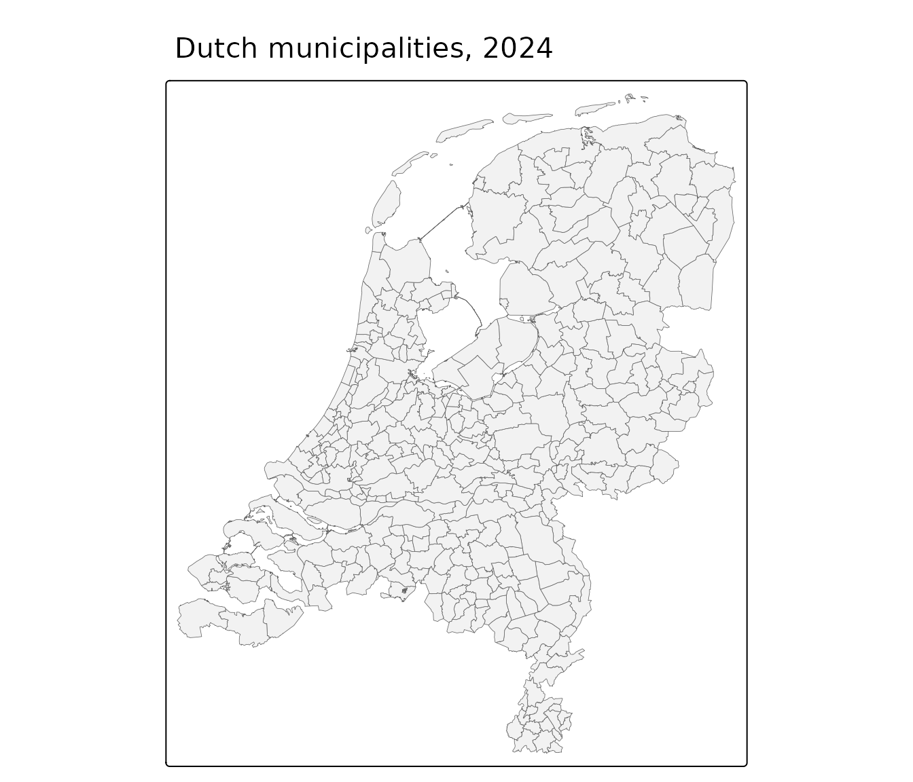

# Getting started

`pdokr` helps you work with open geographic data from
[PDOK](https://www.pdok.nl/), the national geodata platform of the
Netherlands. A typical session has three steps: find a dataset and its
layers, load a layer as an [`sf`](https://r-spatial.github.io/sf/)
object, and take it from there.

``` r

library(pdokr)
```

## 1. Find a dataset

PDOK serves many datasets. Search them by a partial, case-insensitive
term with
[`pdok_search_datasets()`](https://coeneisma.github.io/pdokr/reference/pdok_search_datasets.md),
or list them all with
[`pdok_list_datasets()`](https://coeneisma.github.io/pdokr/reference/pdok_list_datasets.md).

``` r

pdok_search_datasets("gebiedsindelingen")
#> # A tibble: 2 × 7
#>   id                           name  description keywords services owner ogc_url
#>   <chr>                        <chr> <chr>       <list>   <chr>    <chr> <chr>  
#> 1 cbs/gebiedsindelingen-histo… CBS … Deze servi… <chr>    ogc      cbs   https:…
#> 2 cbs/gebiedsindelingen        CBS … Deze servi… <chr>    ogc      cbs   https:…
```

The `id` column is what the rest of the package uses. Here we will use
the CBS administrative boundaries, `"cbs/gebiedsindelingen"`.

## 2. List the layers in a dataset

A dataset contains one or more layers. List them with
[`pdok_list_layers()`](https://coeneisma.github.io/pdokr/reference/pdok_list_layers.md)
(or filter them with
[`pdok_search_layers()`](https://coeneisma.github.io/pdokr/reference/pdok_search_layers.md)).

``` r

pdok_list_layers("cbs/gebiedsindelingen")
#> # A tibble: 63 × 9
#>    dataset layer title description start_date end_date crs    storage_crs bbox  
#>    <chr>   <chr> <chr> <chr>       <date>     <date>   <list>       <int> <list>
#>  1 cbs/ge… arbe… Arbe… Een indeli… 2016-01-01 NA       <int>        28992 <dbl> 
#>  2 cbs/ge… arbe… Arbe… arbeidsmar… 2016-01-01 NA       <int>        28992 <dbl> 
#>  3 cbs/ge… arro… Arro… De arrondi… 2016-01-01 NA       <int>        28992 <dbl> 
#>  4 cbs/ge… arro… Arro… arrondisse… 2016-01-01 NA       <int>        28992 <dbl> 
#>  5 cbs/ge… buur… Buur… Onderdeel … 2016-01-01 NA       <int>        28992 <dbl> 
#>  6 cbs/ge… buur… Buur… buurt_labe… 2016-01-01 NA       <int>        28992 <dbl> 
#>  7 cbs/ge… buur… Buur… buurtnietg… 2016-01-01 NA       <int>        28992 <dbl> 
#>  8 cbs/ge… coro… Coro… De COROP-g… 2016-01-01 NA       <int>        28992 <dbl> 
#>  9 cbs/ge… coro… Coro… coropgebie… 2016-01-01 NA       <int>        28992 <dbl> 
#> 10 cbs/ge… coro… Coro… De COROP-p… 2016-01-01 NA       <int>        28992 <dbl> 
#> # ℹ 53 more rows
```

Each row carries its `dataset`, the `layer` id you pass to
[`pdok_read()`](https://coeneisma.github.io/pdokr/reference/pdok_read.md),
the period the layer covers (`start_date` / `end_date`), and the
coordinate reference systems it offers.

## 3. Load a layer

[`pdok_read()`](https://coeneisma.github.io/pdokr/reference/pdok_read.md)
loads a layer as an `sf` object, handling pagination for you. The CBS
boundaries hold every year in one layer, so we select 2025 with
`datetime`.

``` r

gemeenten <- pdok_read(
  "cbs/gebiedsindelingen", "gemeente_gegeneraliseerd",
  datetime = 2025
)
gemeenten
#> Simple feature collection with 342 features and 8 fields
#> Geometry type: MULTIPOLYGON
#> Dimension:     XY
#> Bounding box:  xmin: 3.358378 ymin: 50.75037 xmax: 7.227498 ymax: 53.55405
#> Geodetic CRS:  WGS 84
#> # A tibble: 342 × 9
#>    einddatum              id jaarcode jrstatcode rubriek  startdatum         
#>  * <dttm>              <int>    <int> <chr>      <chr>    <dttm>             
#>  1 2025-12-31 23:59:59     1     2025 2025GM0014 gemeente 2025-01-01 00:00:00
#>  2 2025-12-31 23:59:59     2     2025 2025GM0034 gemeente 2025-01-01 00:00:00
#>  3 2025-12-31 23:59:59     3     2025 2025GM0037 gemeente 2025-01-01 00:00:00
#>  4 2025-12-31 23:59:59     4     2025 2025GM0047 gemeente 2025-01-01 00:00:00
#>  5 2025-12-31 23:59:59     5     2025 2025GM0050 gemeente 2025-01-01 00:00:00
#>  6 2025-12-31 23:59:59     6     2025 2025GM0059 gemeente 2025-01-01 00:00:00
#>  7 2025-12-31 23:59:59     7     2025 2025GM0060 gemeente 2025-01-01 00:00:00
#>  8 2025-12-31 23:59:59     8     2025 2025GM0072 gemeente 2025-01-01 00:00:00
#>  9 2025-12-31 23:59:59     9     2025 2025GM0074 gemeente 2025-01-01 00:00:00
#> 10 2025-12-31 23:59:59    10     2025 2025GM0080 gemeente 2025-01-01 00:00:00
#> # ℹ 332 more rows
#> # ℹ 3 more variables: statcode <chr>, statnaam <chr>,
#> #   geometry <MULTIPOLYGON [°]>
```

## 4. Make a map

The result is a plain `sf` object, so any mapping package works. We use
[`tmap`](https://r-tmap.github.io/tmap/). A static overview:

``` r

library(tmap)
tmap_mode("plot")
#> ℹ tmap modes "plot" - "view"
#> ℹ toggle with `tmap::ttm()`

tm_shape(gemeenten) +
  tm_polygons(fill = "grey95", col = "grey40", lwd = 0.4) +
  tm_title("Dutch municipalities, 2024")
```



The same code in `tmap`’s interactive mode gives a zoomable, pannable
map you can hover over — try it:

``` r

tmap_mode("view")
#> ℹ tmap modes "plot" - "view"

tm_basemap("CartoDB.Positron") +
  tm_shape(gemeenten) +
  tm_polygons(fill = "grey95", col = "grey40", lwd = 0.4, fill_alpha = 0.5,
              id = "statnaam")
```

## Where to next

- [Filtering data by
  area](https://coeneisma.github.io/pdokr/articles/filtering-by-area.md)
  — filter a layer to a municipality, province, or any polygon,
  including the address-to-area workflow with
  [`pdok_geocode()`](https://coeneisma.github.io/pdokr/reference/pdok_geocode.md).
- [Coordinate reference
  systems](https://coeneisma.github.io/pdokr/articles/coordinate-reference-systems.md)
  — how `pdokr` handles RD New and lon/lat.
- [Working with PDOK by
  hand](https://coeneisma.github.io/pdokr/articles/pdok-by-hand.md) —
  the raw OGC API and WFS requests the package automates.
