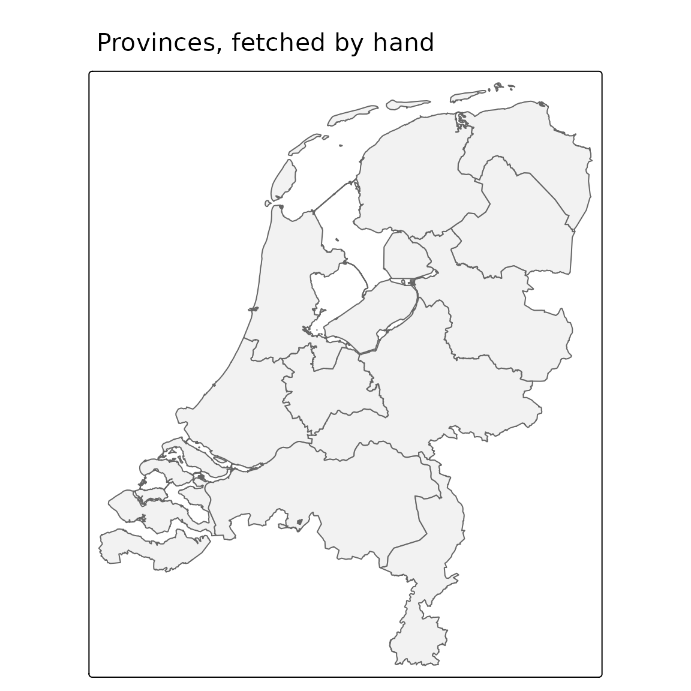

# Working with PDOK by hand

`pdokr` is a thin convenience layer over PDOK’s open web services. This
article shows how to talk to those services directly with
[`httr2`](https://httr2.r-lib.org/) and
[`sf`](https://r-spatial.github.io/sf/), so you understand what the
package automates and can drop down to raw requests when you need to.

``` r

library(httr2)
library(sf)
#> Linking to GEOS 3.12.1, GDAL 3.8.4, PROJ 9.4.0; sf_use_s2() is TRUE
```

## The dataset index

Every OGC API dataset is listed at `https://api.pdok.nl/index.json`.

``` r

index <- request("https://api.pdok.nl/index.json") |>
  req_perform() |>
  resp_body_json()

length(index$apis)
#> [1] 123
index$apis[[1]]$links[[1]]$href
#> [1] "https://api.pdok.nl/kadaster/3d-basisvoorziening/ogc/v1"
```

[`pdok_list_datasets()`](https://coeneisma.github.io/pdokr/reference/pdok_list_datasets.md)
fetches and tidies exactly this.

## The layers in a dataset

Each dataset exposes its layers at `{base}/collections?f=json`.

``` r

collections <- request("https://api.pdok.nl/cbs/gebiedsindelingen/ogc/v1/collections") |>
  req_url_query(f = "json") |>
  req_perform() |>
  resp_body_json()

vapply(collections$collections, function(x) x$id, character(1))[1:6]
#> [1] "arbeidsmarktregio_gegeneraliseerd"    
#> [2] "arbeidsmarktregio_labelpoint"         
#> [3] "arrondissementsgebied_gegeneraliseerd"
#> [4] "arrondissementsgebied_labelpoint"     
#> [5] "buurt_gegeneraliseerd"                
#> [6] "buurt_labelpoint"
```

That is what
[`pdok_list_layers()`](https://coeneisma.github.io/pdokr/reference/pdok_list_layers.md)
parses.

## Reading features

Features come from `{base}/collections/{layer}/items` as GeoJSON. Add
query parameters for the format, a page size, and optional filters. Here
we ask for the 2024 provinces.

``` r

url <- paste0(
  "https://api.pdok.nl/cbs/gebiedsindelingen/ogc/v1/",
  "collections/provincie_gegeneraliseerd/items"
)

resp <- request(url) |>
  req_url_query(
    f = "json",
    limit = 12,
    datetime = "2024-07-01T00:00:00Z"
  ) |>
  req_perform()

provinces <- read_sf(resp_body_string(resp))
provinces[, "statnaam"]
#> Simple feature collection with 12 features and 1 field
#> Geometry type: MULTIPOLYGON
#> Dimension:     XY
#> Bounding box:  xmin: 3.358378 ymin: 50.75037 xmax: 7.227498 ymax: 53.55405
#> Geodetic CRS:  WGS 84
#> # A tibble: 12 × 2
#>    statnaam                                                             geometry
#>    <chr>                                                      <MULTIPOLYGON [°]>
#>  1 Groningen     (((7.209673 53.23964, 7.208053 53.2392, 7.206544 53.23755, 7.2…
#>  2 Fryslân       (((5.373002 53.07226, 5.376507 53.07129, 5.378172 53.0714, 5.3…
#>  3 Drenthe       (((6.494388 53.1982, 6.496428 53.19814, 6.506845 53.20015, 6.5…
#>  4 Overijssel    (((5.7963 52.59229, 5.797743 52.59077, 5.792369 52.59117, 5.78…
#>  5 Flevoland     (((5.863512 52.52035, 5.85877 52.51906, 5.85873 52.51981, 5.85…
#>  6 Gelderland    (((5.605991 52.36322, 5.603903 52.36174, 5.601446 52.3609, 5.6…
#>  7 Utrecht       (((5.021543 52.30246, 5.021867 52.28265, 5.022826 52.28215, 5.…
#>  8 Noord-Holland (((5.326332 52.29079, 5.3271 52.29033, 5.31565 52.2927, 5.3154…
#>  9 Zuid-Holland  (((4.55493 51.69685, 4.544329 51.69513, 4.548551 51.6966, 4.56…
#> 10 Zeeland       (((3.519435 51.40749, 3.54567 51.40531, 3.547676 51.40517, 3.5…
#> 11 Noord-Brabant (((4.872207 51.41288, 4.873107 51.41242, 4.871936 51.41216, 4.…
#> 12 Limburg       (((5.932767 51.74194, 5.935891 51.74103, 5.938299 51.74159, 5.…
```

The CRS of the returned coordinates is announced in a response header
(CRS84, i.e. lon/lat, by default):

``` r

resp_header(resp, "Content-Crs")
#> [1] "<http://www.opengis.net/def/crs/OGC/1.3/CRS84>"
```

A bounding box pre-filter is just another query parameter,
`bbox = "xmin,ymin,xmax,ymax"` in CRS84.

## Pagination

The API does not return all features at once. Each response carries a
[`next`](https://rdrr.io/r/base/Control.html) link when more pages are
available; you follow it until it disappears. (PDOK uses cursor-based
pagination, so you cannot jump to an offset.)

``` r

body <- resp_body_json(resp)
next_link <- Filter(function(l) l$rel == "next", body$links)
length(next_link) # 0 here: all 12 provinces fit on one page
#> [1] 0
```

[`pdok_read()`](https://coeneisma.github.io/pdokr/reference/pdok_read.md)
runs this loop for you and binds the pages into one `sf` object.

## WFS, the older service

PDOK also offers an older Web Feature Service (WFS) for some datasets.
`pdokr` is an OGC API Features client and does not read WFS — almost all
vector data (including BAG) is now available over the OGC API. On the
rare occasion you need a WFS-only layer, GDAL can read it directly,
optionally with a server-side spatial filter:

``` r

# Read a WFS layer by hand (the layer's CRS is RD New / EPSG:28992):
buildings <- read_sf(
  "WFS:https://service.pdok.nl/some/dataset/wfs/v1_0",
  layer = "namespace:layer",
  wkt_filter = sf::st_as_text(area_in_rd_new)
)
```

## Putting it together

What we read by hand is an ordinary `sf` object, ready to map:

``` r

library(tmap)
tmap_mode("plot")
#> ℹ tmap modes "plot" - "view"
#> ℹ toggle with `tmap::ttm()`

tm_shape(provinces) +
  tm_polygons(fill = "grey95", col = "grey40") +
  tm_title("Provinces, fetched by hand")
```



Everything above is what `pdokr` wraps: discovery, pagination, CRS
handling, and the GeoJSON-to-`sf` conversion, behind a handful of
`pdok_*()` functions.

## Where to next

- [Getting
  started](https://coeneisma.github.io/pdokr/articles/getting-started.md)
  — the same tasks with the `pdok_*()` functions.
- [Coordinate reference
  systems](https://coeneisma.github.io/pdokr/articles/coordinate-reference-systems.md)
  — more on CRS84, RD New and axis order.
