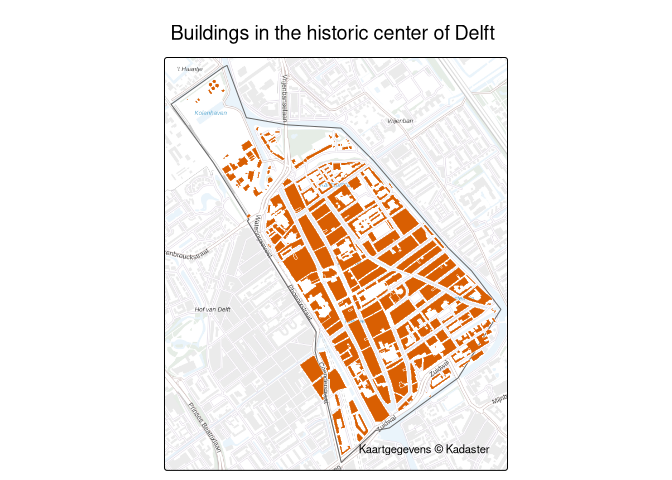

# pdokr

`pdokr` makes it easy to work with open geographic data from
[PDOK](https://www.pdok.nl/) (Publieke Dienstverlening Op de Kaart), the
national geodata platform of the Netherlands. It helps you discover
datasets and their layers, load a layer as an
[`sf`](https://r-spatial.github.io/sf/) object (with automatic
pagination and explicit coordinate reference system handling), filter
data by any polygon area, and geocode addresses and place names.

`pdokr` is a client for PDOK’s **OGC API Features** services: it reads
*vector* feature data (points, lines, polygons) as `sf`. Raster, tile,
and coverage services are out of scope. For the official PDOK map
background, use
[`pdok_basemap()`](https://coeneisma.github.io/pdokr/reference/pdok_basemap.md).

## Installation

`pdokr` is not yet on CRAN. Install the development version from
[GitHub](https://github.com/coeneisma/pdokr):

``` r

# install.packages("remotes")
remotes::install_github("coeneisma/pdokr@develop")
```

## Example

Pick an area from the administrative boundaries, then load another layer
within it. Here we take the historic center of Delft and map every
building in it.

``` r

library(pdokr)
library(tmap)

# A municipality, and one of its districts (the historic center of Delft)
gemeenten <- pdok_read(
  "cbs/gebiedsindelingen", "gemeente_gegeneraliseerd", datetime = 2024
)
delft <- gemeenten[gemeenten$statnaam == "Delft", ]

wijken <- pdok_read(
  "cbs/gebiedsindelingen", "wijk_gegeneraliseerd", datetime = 2024,
  filter_by = delft, predicate = "within"
)
binnenstad <- wijken[wijken$statnaam == "Wijk 11 Binnenstad", ]

# Every building in that district, from the TOP10NL topography
buildings <- pdok_read("brt/top10nl", "gebouw_vlak", filter_by = binnenstad)

# Map it
tmap_mode("plot")
tm_basemap(pdok_basemap("grijs")) +
  tm_shape(binnenstad) +
  tm_borders(col = "grey40") +
  tm_shape(buildings) +
  tm_polygons(fill = "#d95f02", col = "white", lwd = 0.4) +
  tm_title("Buildings in the historic center of Delft") +
  tm_credits("Kaartgegevens © Kadaster")
```



The articles on the [package
website](https://coeneisma.github.io/pdokr/) walk through this and other
workflows, with interactive, zoomable maps.

## Learn more

See the [package website](https://coeneisma.github.io/pdokr/) for the
reference documentation and articles on getting started, filtering data
by area, working with coordinate reference systems, and querying PDOK by
hand.
